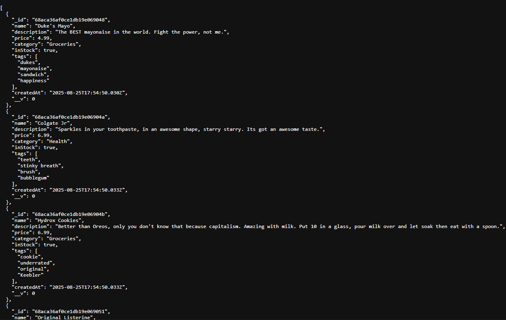

# SBA 13: Build a Product API

[Karl Johnson](https://github.com/hirekarl)  
2025-RTT-30  
<time datetime="2025-08-25">2025-08-25</time>  



## Overview
### Viewer Instructions
1. In the terminal, run:

```bash
cd product-api && npm i && npm run dev
```

2. In the browser, navigate to http://localhost:3001. Run HTTP requests against http://localhost:3001/api/products/.

### Submission Source
Top-level application behavior can be found in [`./product-api/server.js`](./product-api/server.js).

### Reflection
> I implemented a simple static page at http://localhost:3001 that serves hyperlinks to:
> - http://localhost:3001/api/products/createAll: commit all `Product` instances from local objects to database
> - http://localhost:3001/api/products/deleteAll: delete all `Product` instances from database
> - http://localhost:3001/api/products: get all products in the database as JSON
>
> I've spent a decent amount of time doing queries in SQL, so getting my head around Mongoose queries was mostly a matter of learning the new syntax. If I come back to this, I'll probably spend more time finessing error handling.

## Assignment
You are a backend developer for “Zenith,” a rapidly growing e-commerce company. The company needs a robust and scalable API to manage its product inventory. This API will be the backbone of their new online store, used by internal tools for inventory management and by the public-facing website to display products to customers.

Your task is to design and build this RESTful API from the ground up using Node.js, Express, and Mongoose. The API must handle all fundamental CRUD operations and include advanced features like filtering, sorting, and pagination to manage a large and complex product catalog.
